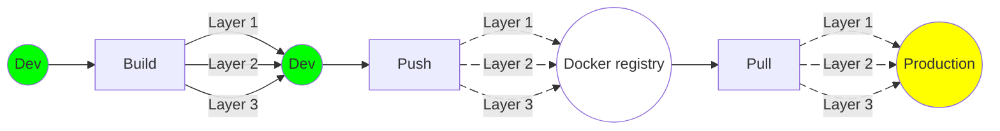

# Introduction

[uv](https://docs.astral.sh/uv/) is a modern, fast, Python package and project manager. It is arguably the best thing happened to the Python ecosystem in recent years.

Before its arrival, I had to use a combination of multiple tools to manage a project's dependencies and environments, such as `pip`, `venv`, `pyenv`, `poetry`, etc. And it required multiple steps to setup dev environment for a new project, which is quite error-prone. `uv` is a single tool to replace all of them, and I don't even need Python installed on my machine to use it.

There has been a lot of hype around uv since its release, and plenty of resources explaining its benefits and how to use it. So I won't delve into the details here, since it is not the focus of this post.

Switching to uv is quite straight-forward for most projects. However, there exists some edge cases that prevent teams from adopting it, such as adapting an existing `Dockerfile`.

For that purpose, the uv documentation already provides a very comprehensive [guide to use uv in Docker](https://docs.astral.sh/uv/guides/integration/docker/#using-uv-in-docker), and a repository with [multiple examples](https://github.com/astral-sh/uv-docker-example) that covers most use cases, including multi-stage builds.

This post is dedicated to an edge case that is not detailed in the documentation, which is **generating multiple dependency layers to optimize the Docker workflow from development to production.**

# Docker lifecycle and Dockerfile

Before diving into the main content, I'll first explain the importance of writing a good `Dockerfile`, and how it will affect each stage in the Docker lifecycle. If you are already familiar with Docker and its core concepts, you can skip this section straight to the [main course](#dockerfile-with-uv).

## Docker lifecycle

There are 3 primary stages in the Docker workflow:

1. **Build**: build the image from a Dockerfile. They are typically used during development to test the application, which means the image is built and run on the dev machine. If you develop using a Docker container, the build process is executed very frequently, and should be as fast as possible.
2. **Push**: publish the image to the Docker registry (public or private), typically done in a CI/CD pipeline together with `build`. The image is then stored in the registry, and can be pulled by remote machines (production environment, on-premise machines, etc.).
3. **Pull**: pull the image from the registry to run it. Mostly done in production environment.



<div style="text-align: center">
<a href="#docker-lifecycle"><i>Simplified Docker lifecycle</i></a>
</div>

## What is a Dockerfile?

A `Dockerfile` is a text file that contain a series of instructions and commands to define the environment and dependencies of your application, that Docker follows to assemble the image layer by layer.

One of the most important concepts in Docker is the [cache layer](https://docs.docker.com/build/cache/). It is a mechanism that allows Docker to reuse the same layer for subsequent builds, pushes and pulls processes, which is crucial to speed up the whole workflow.

As we can see in the [diagram above](#docker-lifecycle), the cache layers are propagated all the way from the `build` stage through the `push` and `pull` stages. If `layer 2` is invalidated for example, the subsequent `layer 3` will be invalidated as well, and both layers will have to be rebuilt and propagated again through the network. Hence, the general rule of thumb is to order the layers **from the least likely to change to the most likely to change**.

Another important factor to consider is **the size of the image**. The smaller the image, the faster the `push` and `pull` processes, and the lower the storage cost.

> This is particularly useful for remote machines with limited bandwidth or unstable Internet connection. It is a specific use case that I encountered at work, which inspired this post.
{: .prompt-warning }

Now that the basics are covered, let's move on to the main content.

# Dockerfile with uv

In this section we will cover 2 scenarios and how to adapt the `Dockerfile` with `uv` in each case.

1. [Multi-layer dependencies within a single-stage build](#multi-layer-dependencies-within-a-single-stage-build)
2. [Multi-layer dependencies with multi-stage builds](#multi-layer-dependencies-with-multi-stage-builds)

But first, let's define an example project and go through some minimal steps to migrate it to `uv`.

## Migrate existing project to uv via pyproject.toml

Considering a simple `FastAPI` project with the following requirements files:

-   `requirements-heavy.txt` with heavy packages that take a long time to install but rarely need to be updated:

```
torch==2.7.0
```

-   `requirements.txt` with light packages that are frequently updated:

```
fastapi==0.115.12
uvicorn==0.34.2
```

-   `requirements-dev.txt` for development dependencies:

```
pytest==8.3.5
ruff==0.11.11
```

To migrate the project to `uv`, we can simply create a `pyproject.toml` as below.

```toml
[project]
name = "test-project"
version = "0.0.0"
requires-python = "==3.12.*"
dependencies = []

[dependency-groups]
dev = ["pytest==8.3.5", "ruff==0.11.11"]
heavy-rarely-updated = ["torch==2.7.0"]
light-frequently-updated = ["fastapi==0.115.12", "uvicorn==0.34.2"]

[tool.uv]
default-groups = ["dev", "heavy-rarely-updated", "light-frequently-updated"]
```

The `pyproject.toml` file is the new standard for Python projects. It replaces all requirements files by defining all the dependencies in a single file, split into named groups.

To generate the virtual environment will all dependencies installed, simply run the following command:

```shell
uv sync
```

This command will also create an auto-generated `uv.lock` file that locks the dependencies of the project. This is super useful to ensure that the dependencies and sub-dependencies are the same across different machines.

Additionaly, the `requires-python` field specifies the Python version that the project should run on, which will be picked up automatically by `uv` to generate the virtual environment. If the specific version does not exist on the machine, `uv` will automatically download it for immediate and future use without any input from the user. Very handy!

However, this structure raises 2 obvious questions that affecting the project's `Dockerfile`:

1. If we make unrelated changes to `pyproject.toml`, such as updating the project name or version, how to avoid invalidating the whole layer?
2. How can we adapt a multi-layer structure with one single `pyproject.toml` file instead of multiple requirements files?

We will try to answer these questions in the following approaches.

## Multi-layer dependencies within a single-stage build

Let's consider this legacy `Dockerfile` that uses `pip` to install the Python dependencies.

```dockerfile
FROM python:3.12.10-slim-bookworm

# System dependencies: gcc for dependencies building
RUN apt-get update \
    && apt-get install -y --no-install-recommends gcc \
    && rm -rf /var/lib/apt/lists/*

ENV PIP_DISABLE_PIP_VERSION_CHECK=1 \
    PIP_NO_CACHE_DIR=1

WORKDIR /app

# LAYER 1: heavy dependencies, rarely updated
COPY requirements-heavy.txt .
RUN pip install -r requirements-heavy.txt

# LAYER 2: light dependencies, frequently updated
COPY requirements.txt .
RUN pip install -r requirements.txt

# LAYER 3: source code
COPY src src

EXPOSE 8000

CMD ["uvicorn", "src.main:app", "--host", "0.0.0.0", "--port", "8000"]
```

This is a very common structure where the dependencies are installed in 3 separate `cache layers`. It allows us to modify the light dependencies and the source code without invalidating the heavy dependencies layer, which **takes a long time to build**.

The adaptation for this case is covered in the uv [documentation](https://docs.astral.sh/uv/guides/integration/docker/#intermediate-layers) and [example](https://github.com/astral-sh/uv-docker-example/blob/main/Dockerfile) as below.

```dockerfile
FROM python:3.12.10-slim-bookworm

# System dependencies should be the first layer before uv since they might be heavier and less likely to change.
RUN apt-get update \
    && apt-get install -y --no-install-recommends gcc \
    && rm -rf /var/lib/apt/lists/*

# Copy uv binary from the official image instead of using base image with uv pre-installed.
# It allows to use the same image as before migration, and only install uv when needed.
COPY --from=ghcr.io/astral-sh/uv:latest /uv /uvx /bin/

WORKDIR /app

# Force uv to use system Python instead of downloading it
ENV UV_PYTHON_DOWNLOADS=0

# Enable bytecode compilation to speed up the startup time
ENV UV_COMPILE_BYTECODE=1

# Copy from the cache instead of linking since it's a mounted volume
ENV UV_LINK_MODE=copy

# Force the build to fail if the auto-generated lock is not up to date
ENV UV_LOCKED=1

# LAYER 1 + 2: install HEAVY and LIGHT dependencies
# 1. The cache is mounted to avoid re-downloading the dependencies if the lock file is not updated.
# 2. The pyproject.toml and uv.lock files are bind-mounted which prevents the build from being invalidated by unrelated changes.
# 3. The --no-install-project flag is used to avoid installing the project as a package, since the source code has not been copied yet.
# 4. The --no-dev flag is used to avoid installing the development dependencies.
RUN --mount=type=cache,target=/root/.cache/uv \
    --mount=type=bind,source=uv.lock,target=uv.lock \
    --mount=type=bind,source=pyproject.toml,target=pyproject.toml \
    uv sync --no-install-project --no-dev

# LAYER 3: source code
COPY src src

# Place executables in the environment at the front of the path
ENV PATH="/app/.venv/bin:$PATH"

EXPOSE 8000

CMD ["uvicorn", "src.main:app", "--host", "0.0.0.0", "--port", "8000"]
```

Most of the comments are self-explanatory. In particular, we combined 2 Docker techniques to optimize the dependencies layer:

-   [bind mount](https://docs.docker.com/build/cache/optimize/#use-bind-mounts): links `pyproject.toml` and `uv.lock` from the host machine to the container for temporary use **without generating any layer**. If `COPY` is used here, it would **generate a layer** that would be invalidated by any changes to the files.
-   [cache mount](https://docs.docker.com/build/cache/optimize/#use-cache-mounts): persists the uv cache for packages installation across builds, so even if the layer is rebuilt, only new or changed packages are downloaded.

Thus, this layer will only be invalidated if changes are made to the dependencies. Even so, it won't have to redownload everything, since the cache is mounted.

Even though quite efficient, this approach is NOT an equivalent adaptation of the legacy `Dockerfile`, since the layers will be invalidated by dependency changes no matter what.

As far as I know, **it is impossible to achieve multi-layer dependencies in a single-stage build** using a single `pyproject.toml` as with multiple requirements files.

Fortunately, we can use [multi-stage build](https://docs.docker.com/build/building/multi-stage/) technique to achieve this.

## Multi-layer dependencies with multi-stage builds

As you must have noticed, both approaches above are rather wasteful in terms of image size, as they must install `gcc` in system packages, and `uv` itself is not needed either during runtime.

To address this issue, we can use [multi-stage build](https://docs.docker.com/build/building/multi-stage/) to install the dependencies in a separate stage, then copy the built packages to the final image.

The legacy `Dockerfile` would be as follows:

```dockerfile
# 1. Builder stage: build dependencies into separate folders
FROM python:3.12.10-slim-bookworm AS builder

ENV PIP_DISABLE_PIP_VERSION_CHECK=1

WORKDIR /packages

RUN apt-get update && apt-get install -y --no-install-recommends gcc

COPY requirements-heavy.txt .
RUN pip3 install --prefix=./heavy -r requirements-heavy.txt

COPY requirements.txt .
RUN pip3 install --prefix=./light -r requirements.txt


# 2. Final image without gcc
FROM python:3.12.10-slim-bookworm

ENV PYTHON_PATH=/usr/local

WORKDIR /app

# LAYER 1: heavy dependencies
COPY --from=builder /packages/heavy ${PYTHON_PATH}

# LAYER 2: light dependencies
COPY --from=builder /packages/light ${PYTHON_PATH}

# LAYER 3: source code
COPY ./src ./src

EXPOSE 8000

CMD ["uvicorn", "src.main:app", "--host", "0.0.0.0", "--port", "8000"]
```

And the uv-specific `Dockerfile`:

```dockerfile
# 1. Generator stage: generate requirements files
FROM python:3.12.10-slim-bookworm AS generator

COPY --from=ghcr.io/astral-sh/uv:latest /uv /uvx /bin/

# Configure uv settings
ENV UV_LINK_MODE=copy \
    UV_LOCKED=1

WORKDIR /packages

# Generate requirements files for each group
RUN --mount=type=bind,source=uv.lock,target=uv.lock \
    --mount=type=bind,source=pyproject.toml,target=pyproject.toml \
    uv pip compile --emit-index-url --group heavy-rarely-updated -o requirements-heavy.txt \
    && uv pip compile --emit-index-url --group light-frequently-updated -o requirements-light.txt

# 2. Builder stage: build dependencies into separate folders
FROM python:3.12.10-slim-bookworm AS builder

# Install build dependencies: gcc and uv
RUN apt-get update && apt-get install -y --no-install-recommends gcc
COPY --from=ghcr.io/astral-sh/uv:latest /uv /uvx /bin/

# Configure uv settings
ENV UV_PYTHON_DOWNLOADS=0

WORKDIR /packages

COPY --from=generator /packages/requirements-heavy.txt ./
RUN uv pip install --prefix=./heavy --no-deps -r requirements-heavy.txt

COPY --from=generator /packages/requirements-light.txt .
RUN uv pip install --prefix=./light --no-deps -r requirements-light.txt


# 3. Final image without gcc and uv
FROM python:3.12.10-slim-bookworm

ENV PYTHON_PATH=/usr/local

WORKDIR /app

# LAYER 1: heavy dependencies
COPY --from=builder /packages/heavy ${PYTHON_PATH}

# LAYER 2: light dependencies
COPY --from=builder /packages/light ${PYTHON_PATH}

# LAYER 3: source code
COPY ./src ./src

EXPOSE 8000

CMD ["uvicorn", "src.main:app", "--host", "0.0.0.0", "--port", "8000"]
```

There are 3 stages in the `uv` approach instead of 2 as in the legacy `Dockerfile`. If you look closely, the builder and final stages are quite similar. Both approaches make use of the [pip --prefix option](https://pip.pypa.io/en/stable/cli/pip_install/#cmdoption-prefix) to install each dependencies group into a separate directory, which is then copied to the final image, each copy being a separate layer.

The biggest difference is the additional `generator` stage in the `uv` approach. It is necessary to generate the requirements files for each dependencies group, which are then copied to the builder stage. The separate stage is **required** to avoid invalidating the builder stage by unrelated changes to the `pyproject.toml` file.

# Comparison with actual data

Now it's time to test the 4 approaches with actual data, let's name them: `pip-single`, `uv-single`, `pip-multi` and `uv-multi`.

For each approach, I will execute the following steps and measure the execution time, as well as the image size.

1. **Cold build**: build the image from scratch

```shell
time docker build -f Dockerfile-uv-multi -t localhost:5000/test-repo:uv-multi-cold .
```

2. **Hot build**: build the image again with a small dependency update to `light-frequently-updated` group. This will allow us to verify the `heavy-rarely-updated` cache layer invalidation mechanism.

```shell
time docker build -f Dockerfile-uv-multi -t localhost:5000/test-repo:uv-multi-hot .
```

3. **Cold push**: push the cold built image to the local registry

4. **Hot push**: push the hot built image to the local registry

```shell
docker run -d -p 5000:5000 --name registry registry:latest
time docker push localhost:5000/test-repo:uv-multi-cold
time docker push localhost:5000/test-repo:uv-multi-hot
```

It is not necessary to include the `pull` process, since the layers are identical to the `push` step and the results should be roughly the same.

In between each approach, I will reset the local registry and the docker caches to simulate a cold start.

```shell
docker stop registry
docker system prune -a --volumes
```

Without further ado, here are the results.

| Approach       | pip-single | pip-multi | uv-single | uv-multi |
| -------------- | ---------- | --------- | --------- | -------- |
| **Cold build** | 268.98s    | 287.51s   | 244.29s   | 241.45s  |
| **Hot build**  | 4.75s      | 14.90s    | 153.01s   | 8.61s    |
| **Cold push**  | 9.26s      | 7.09s     | 8.33s     | 8.60s    |
| **Hot push**   | 1.03s      | 0.93s     | 7.95s     | 1.02s    |
| **Image Size** | 9.05 GB    | 8.81 GB   | 9.13 GB   | 8.66 GB  |

As expected, the `uv-multi` approach is the fastest and the smallest in terms of image size, thanks to `uv` speed and optimized lock file.

The `uv-single` method is also fast during a **cold build**, but struggles with the **hot build** and **hot push** steps, which is also expected since the whole dependencies layer is invalidated.

The `pip-single` method wins the **hot build** step due to the nature of single-stage build.

# Conclusion

The `uv-multi` approach is the clear winner in terms of speed and image size, but it requires a bit more effort to set up, which renders the Dockerfile much more complex. I would recommend this approach for large projects with many heavy dependencies such as `torch` or `tensorrt`.

For projects with only light dependencies and where image size is not a big concern, the `uv-single` approach is the simplest to set up and maintain. Most of the time you won't notice any difference due to the speed of `uv`.

I would not recommend using the legacy `pip` methods, since it will defeat the whole purpose of this post 😛. They are a relic of the past and should stay that way.
